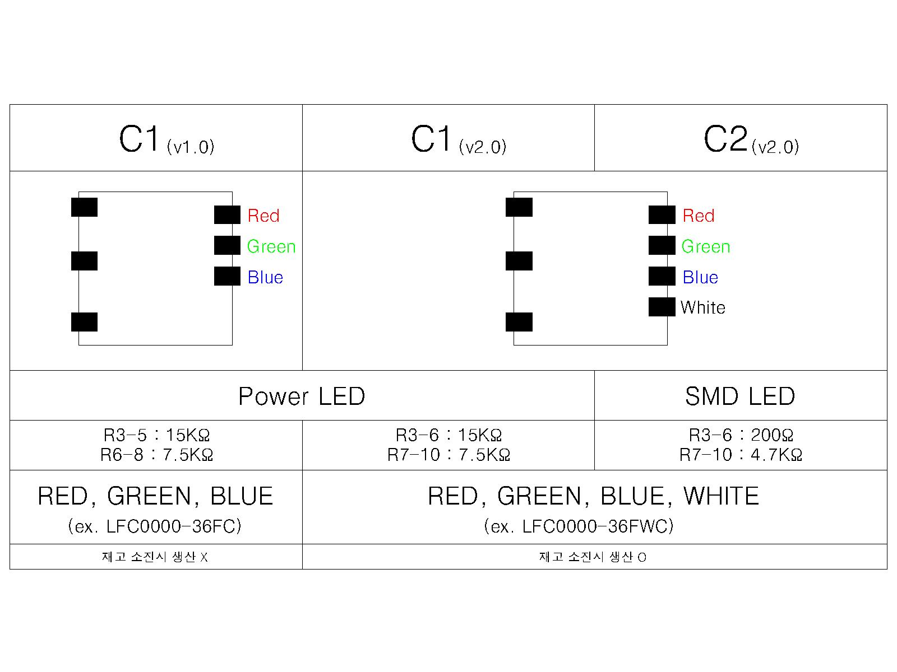

# C1

## C1 버젼별 SMT 사용 주의 사항

Partlist 에 v1.0 으로 표시되었을 경우에 v1.0 의 대체품으로 v2.0 를 사용할 수 있습니다.
하지만 v2.0 으로 표시되었을때, v1.0 을 사용할 수 없습니다.
v1.0 에는 RGBW 제어 기능이 없기 때문입니다.

## v2.0 2019/03/18 신민정

### 생산 지시서 번호
* 발주 번호 : X
* 번호 미확인시 사유 : 개발PCB
* 요청 담당자 : 개발주
* 요청일 : 2019/02/27

###  BOM 품목코드
* H0000437

### DRC(Design Rule Check)
* 확인

### 수정 내역
* PAD bottom에만
* white 회로 추가

### 표준회로
* SUB : c4_pwm4ch
* Connector : PAD 
* Driver :  X

----------

## v1.0 2018/09/27 신민정

### 생산 지시서 번호
* 발주 번호 : X
* 번호 미확인시 사유 : 개발PCB
* 요청 담당자 : 개발부
* 요청일 : 2018/09/20

###  BOM 품목코드
* H0000344

### DRC(Design Rule Check)
* 확인

### 표준회로
* SUB : c1_pwm3ch
* Connector : PAD
* Driver :  X