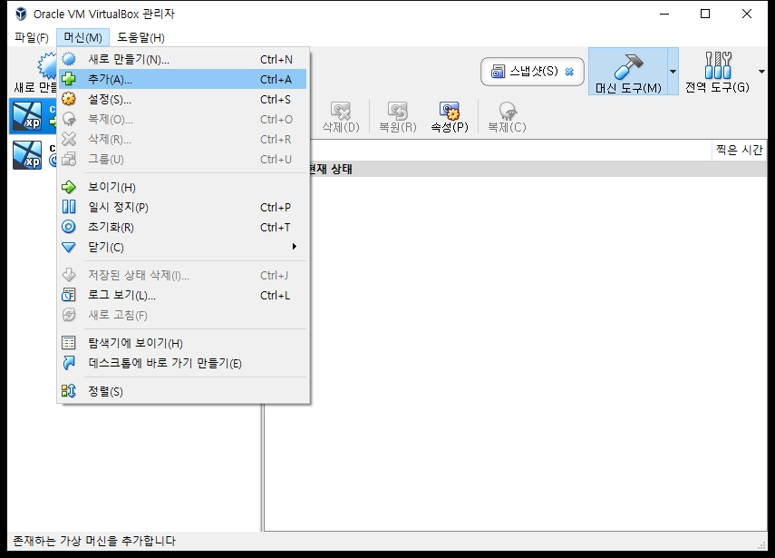
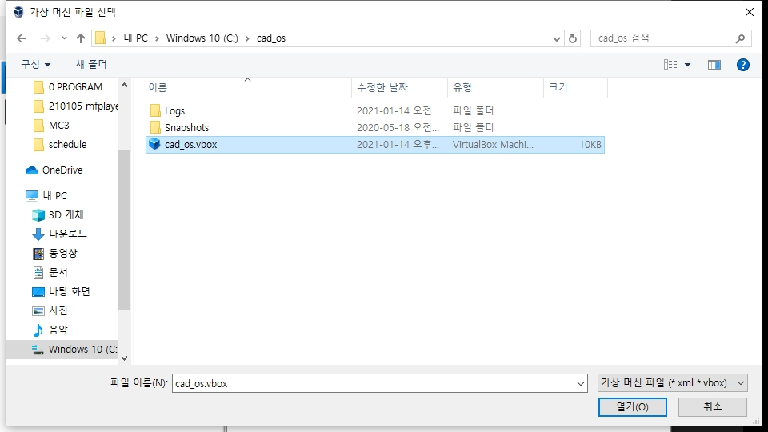
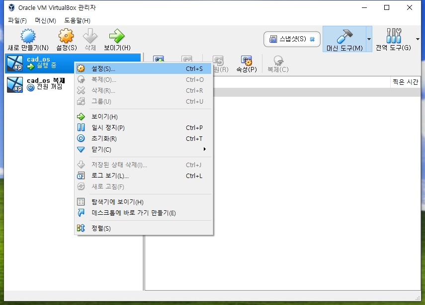
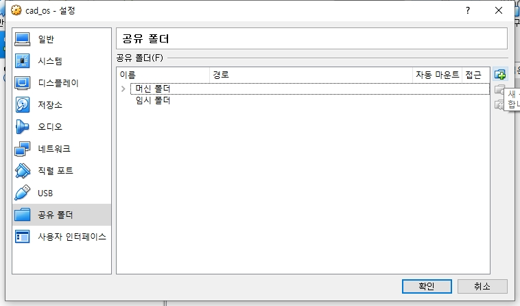
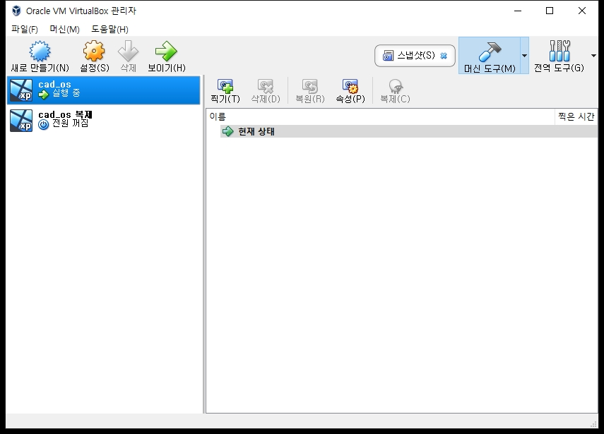

# PCB 열기

## 1. VirtualBox 다운로드
https://www.virtualbox.org/ 

## 2. os 복사
\\diskstation\04.개발팀\90. SW\90_ETC\1. OS\1. V_XP\cad_os\
를 내 컴퓨터로 복사합니다.

## 3. VirtualBox 에 os 추가
cad_os.vbox를 추가합니다.

### 3. 공유폴더
버추어 머신과 공유할 폴더를 설정합니다.

## 4. 실행
추가된 os를 더블클릭하여 실행합니다.

